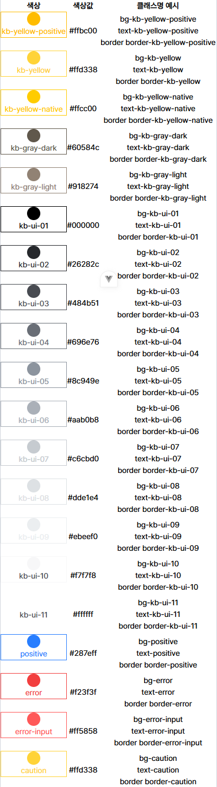

# FinalProjectFront

> 이 저장소는 최종 프로젝트의 프론트엔드 코드입니다.
> 백엔드 관련 설정 및 API 문서는 아래 레포지토리를 참고하세요:
> 👉 [FinalProjectBack GitHub Repository](https://github.com/KB-its-your-life-Final-Project/FinalProjectBack/blob/main/.github/CONTRIBUTING.md)

## 목차

1 사용 언어 및 기술
2 디렉토리 구조
3 초기 설정
4 개발 및 빌드
5 코드 정리 및 검사
6 커스텀 스타일 클래스명 (tailwind)

## 1 사용 언어 및 기술

- 언어: TypeScript 5.8.3
- 프레임워크: Vue.js 3.5.17
- 라우터: Vue Router 4.5.1
- 상태 관리: Pinia 3.0.3
- API 통신: Axios 1.10.0
- 스타일: Tailwind 4.1.11
- 코드 포매터: Prettier 3.5.3
- 코드 린터: ESLint 9.30.1

## 2 디렉토리 구조

```sh
src/
├── api/                       # Axios 인스턴스 및 도메인별 API 요청 모듈
│   ├── apiClient.ts           # Axios 기본 설정
│   └── authApi.ts             # 예시) 인증 관련 API

├── assets/                    # 정적 자산 (글꼴, 이미지, 스타일)
│   ├── fonts/                 # 글꼴 파일
│   ├── imgs/                  # 이미지 파일
│   └── styles/                # 전역 스타일 파일

├── components/                # 컴포넌트
│   ├── common/                # 공통 UI 컴포넌트 (버튼, 모달 등)
│   ├── layouts/               # 레이아웃 관련 컴포넌트
│   └── auth/                  # 예시) 인증 관련 컴포넌트

├── config/                    # 설정 파일
│   └── index.ts

├── pages/                     # 화면
│   ├── auth/                  # 예시) 인증 관련 화면
│   └── NotFoundPage.vue       # 404 Not Found 화면

├── router/                    # Router
│   ├── index.ts               # 라우터 생성 및 설정
│   └── authRoutes.ts          # 예시) 인증 관련 라우트

├── stores/                    # Pinia 스토어 (상태 관리)
│   └── authStore.ts           # 예시) 인증 관련 상태 관리

├── utils/                     # 부가 기능 함수

├── App.vue                    # root 컴포넌트
└── main.ts                    # 앱 진입점
```

## 3 초기 설정

##### 필요한 패키지 설치

```sh
npm install
```

## 4 개발 및 빌드

##### 개발 서버 실행 (Hot Reload)

- 서버 실행 및 변경 사항 즉시 반영

```sh
npm run dev
```

##### 프로덕션 빌드

- 타입 체크, 컴파일 및 압축

```sh
npm run build
```

## 5 코드 정리 및 검사

##### 코드 포맷

- 세미콜론, 줄바꿈, 쌍따옴표 변환 등 코드 스타일 통일

```sh
npx prettier --write .
```

##### 코드 린트 검사

- 문법 오류, 사용하지 않는 변수, 일관성 없는 코드 스타일 등 검사

```sh
npm run lint
```

## 6 커스텀 스타일 클래스명 (tailwind)

##### 폰트 (Pretendard)

| 폰트 이름               | 클래스명                       |
| ----------------------- | ------------------------------ |
| "Pretendard-Thin"       | `--font-pretendard-thin`       |
| "Pretendard-ExtraLight" | `--font-pretendard-extralight` |
| "Pretendard-Light"      | `--font-pretendard-light`      |
| "Pretendard-Medium"     | `--font-pretendard-medium`     |
| "Pretendard-Regular"    | `--font-pretendard-regular`    |
| "Pretendard-SemiBold"   | `--font-pretendard-semibold`   |
| "Pretendard-Bold"       | `--font-pretendard-bold`       |
| "Pretendard-ExtraBold"  | `--font-pretendard-extrabold`  |
| "Pretendard-Black"      | `--font-pretendard-black`      |

| 색상값  | 클래스명 예시             |
| ------- | ------------------------- |
| #ffbc00 | `--bg-kb-yellow-positive` |
| #ffd338 | `--bg-kb-yellow`          |
| #ffcc00 | `--bg-kb-yellow-native`   |
| #60584c | `--bg-kb-gray-dark`       |
| #918274 | `--bg-kb-gray-light`      |
| #000000 | `--bg-kb-ui-01`           |
| #26282c | `--bg-kb-ui-02`           |
| #484b51 | `--bg-kb-ui-03`           |
| #696e76 | `--bg-kb-ui-04`           |
| #8c949e | `--bg-kb-ui-05`           |
| #aab0b8 | `--bg-kb-ui-06`           |
| #c6cbd0 | `--bg-kb-ui-07`           |
| #dde1e4 | `--bg-kb-ui-08`           |
| #ebeef0 | `--bg-kb-ui-09`           |
| #f7f7f8 | `--bg-kb-ui-10`           |
| #ffffff | `--bg-kb-ui-11`           |
| #287eff | `--bg-positive`           |
| #f23f3f | `--bg-error`              |
| #ff5858 | `--bg-error-input`        |
| #ffd338 | `--bg-caution`            |


